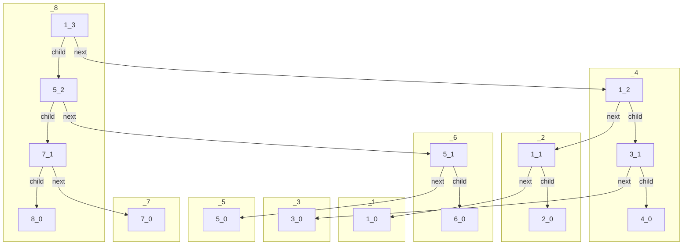

# Softheap
Мягкая куча - последовательность модифицированных биномиальных деревьев различных рангов, называемых _мягкие очереди_. Модификации включают в себя:
* ***Мягкая очередь q*** - биномиальное дерево, поддеревья которого, возможно, отсутствуют. 
Биномиальное дерево, из которого построена мягкая очередь, называется ___мастер-деревом___. 
___Ранг___ вершины q - это количество детей у соответствующей вершины в мастер-дереве. Очевидно, это верхняя граница на количество детей для вершины q. 
Гарантируется следующее: количество детей у вершины должно быть не меньше, чем _"округление вниз от (ранг(q)/2)"_.
* Узел ___v___ хранит в себе односвязный список элементов. Поле **ckey** узла v является общим значением всех текущих ключей элементов из списка _(max????)_ (верхней границей оригинальных ключей). Мягкая очередь обладает кучеобразнастью по полю **ckey** - это значит, что **ckey** узла не превышает **ckey** любого из детей. 
Введем параметр r = r(e) и будем требовать, чтобы все испорченные элементы лежали бы в узлах, чей ранг больше, чем r.

У узла есть поля ckeys и ранг в соответствущем мастер-дереве. Поля _next_ и _child_ используются для доступа к детям. Текущий узел для Child - родитель мягкой очереди ранга на 1 меньше, для Next - корень мягкой очереди ранга на 1 меньше (используется для того, чобы заимплементить вариант, когда у нас несколько детей. Вместо child[0], child[1] мы делаем child, next->child. Короче, это просто лист детей ~). Такая уловка используется для представления высоко-степенных улов в виде последовательности узлов степени 2. Также у нас имеется список элементов внутри узла.

В общем виде куча представляется в виде двусвязного корневого списка h1...hm. Каждый корень hi имеет два дополнительных указателя: один указывает на корень очереди (Ri) (queue), а другой на корень (Rj) (suffix_min) с минимальным ckey среди всех Rj'ых (j>=i). Требуется, чтобы ранг(R1)< ... < ранг(Rm) (В корневом списке каждая последующая очередь имеет более высокий ранг). Ранг очереди  - ранг корня. Это значение хранится в корне очереди. Ранг кучи - максимальный из рангов очередей.

# Методы
### Инициализация:
* Head - корень 
* Tail - хвост с бесконечным рангом.
* r = R(e)

```c++
head *header, *tail; 
int r;
header = new_head(); 
tail   = new_head(); 
tail->rank=INFTY; 
header->next = tail;
tail->prev = header;
printf (“Enter r:”); 
scanf (“%d”, &r);
```

### Удаление
Может быть заимплеменчено в ленивой форме: помечаем, что узел надо удалить, но удаляем фактиччески, когда findmin попытается его вернуть.

### Вставка
* Создаем одно-узловую очередь
* Объединяем с кучей
```c++
insert(int newkey)
{
    node *q;
    ilcell *l;
    l = (ilcell *)malloc(sizeof(ilcell));
    l->key = newkey;
    l->next = NULL;
    q = new_node();
    q->rank = 0;
    q->ckey = newkey;
    q->il = l;
    q->il_tail = l;
    meld(q)
}
```

### Объединение двух куч
* Пусть у нас есть две кучи A1 и A2. 
* Пусть куча A2 имеет меньший ранг и мы будем встраивать каждую из ее очердей в кучу A1. 
* Для того, чтобы встроить очередь ранга K в кучу A1:
    *  Мы смотрим на наименьший такой индекс i, где ранг очереди Ri >=K. (Пустой хвост подразумевает, что i всегда есть)
    *  Если ранг Ri > K, мы вставляем  очередь прям перед этой очередью (~~ нет очереди с таким рангом, так что спокойно вставляемся)
    *  Иначе объединяем две очереди в очередь ранга K+1 путем превращения корня с наибольшим ключом ребенком другого корня. Повторяем процесс объединения для новой очереди
*  После вставки обновляем значение поля suffix_min для всех очередей от первой до последней посещенной (меньших по индексу, так как suffix_min всегда смотрит "вправо") (в случае объединения куч, а не очередей можно сделать это в сааааамом конце)
```c++
meld(node *q)
{
    /* 1) Scan head-list to find place where to place new queue */
    head *tohead = header->next;
    while (q->rank > tohead->rank)
        tohead = tohead->next;

    head* prevhead = tohead->prev;

    /* 2) If new place rank == rank(q), then merge them */
    node *top, *bottom;
    while (q->rank == tohead->rank)
    {
        if (tohead->queue->ckey > q->ckey)
        {
            top = q;
            bottom = tohead->queue;
        }
        else
        {
            top = tohead->queue;
            bottom = q;
        }
        q = new_node();
        q->ckey = top->ckey;
        q->rank = top->rank + 1;
        q->child = bottom;
        q->next = top;
        q->il = top->il;
        q->il_tail = top->il_tail;
        tohead = tohead->next;
    }
    /* 3) Actually insert.. */
    head* h;
    if (prevhead == tohead->prev)
        h = new_head();
    else // actually we've moved out queue from this one...
        h = prevhead->next;
    h->queue = q;
    h->rank = q->rank;
    h->prev = prevhead;
    h->next = tohead;
    prevhead->next = h;
    tohead->prev = h;
    // restore suffix_min
    fix_minlist(h);
    }
```

### Исправление suffix_min
Предполагается, что некорректны только поля между корнем и h
```c++
fix_minlist(head *h)
{
    head *tmpmin;
    if (h->next == tail)
        tmpmin = h;
    else
        tmpmin = h->next->suffix_min;
    while (h != header)
    {
        if (h->queue->ckey < tmpmin->queue->ckey)
            tmpmin = h;
        h->suffix_min = tmpmin;
        h = h->prev;
    }
}
```

### Sift
Функция `sift(h->queue, h->rank)` заменяет пустой список некоторым другим. Мы будем это делать, пока новый список в корне не будет пустым. **Это основа soft_heap**

Функция "переносит" элементы из списков элементов дерева в корень<br>
В процессе обхода мы проверяем, если вершина не имеет списка элементов, то ей задается ckey равным бесконечности, чтобы хранить такие вершины в конце очереди. Если у вершины next/child - Null - это лист

```c++
node *sift(node *v)
{
    node *tmp;
    v->il = NULL;
    v->il_tail = NULL;
    if (v->next == NULL && v->child == NULL)
    {
        v->ckey = INFTY;
        return v;
    }
    v->next = sift(v->next);

    // It is possible that v->next has INFTY ckey. Swap it in this case 
    if (v->next->ckey > v->child->ckey)
    {
        tmp = v->child;
        v->child = v->next;
        v->next = tmp;
    }

    // Move item list from v->next to v
    v->il = v->next->il;
    v->il_tail = v->next->il_tail;
    v->ckey = v->next->ckey;

    // Sometimes we can do it twice due branching
    if(v->rank > r && 
    (v->rank % 2==1 || v->child->rank < v->rank-1))
    {
        v->next = sift(v->next);
    
        // Do it again
        if (v->next->ckey > v->child->ckey)
        {
            tmp = v->child;
            v->child = v->next;
            v->next = tmp;
        }

        // Concatenate lists if not empty
        if (v->next->ckey ! = INFTY && 
            v->next->il ! = NULL)
        {
            v->next->il_tail->next = v->il;
            v->il = v->next->il;
            if (v->il_tail == NULL)
                v->il_tail = v->next->il_tail;
            v->ckey = v->next->ckey;
        }
    } /*  end of second sift */

    // Clean Up
    if (v->child->ckey == INFTY)
    {
        if (v->next->ckey == INFTY)
        {
            v->child = NULL;
            v->next = NULL;
        }
        else
        {
            v->child = v->next->child;
            v->next = v->next->next;
        }
    }
    return v;
}
```

### Deletemin
Поле _suffix_min_ у начала корневого списка указывает на начало h с минимальным ckey (испорченным или нет). Проблема, что список элементов может быть пустым. В таком случае мы должны заполнить список элементами из ниже лежащих в очереди узлов, указываемых из h. <br>

Функция возвращает элемент с наименьшим ckey и удаляет его. С помощью _suffix_min_ мы легко получаем нужную вершину. Однако, она может быть пуста и нам придется вызвать sift. Возможно, более одного раза, чтобы поместить элементы в список корня. Но для начала нам стоит проверить, не нарушен ли инвариант ранга: прошлый sift мог примервсти к потере некоторых вершин и нарушению инварианта. 

Плюс такого позднего обнаружения нарушения инварианта ранга в том, что исправить эту ситуацию намного проще, когда список элементов корня пустой. Если инвариант нарушен (childcount < h->rank/2), мы удаляем очередь и обновляем корневой список и указатели suffix_min. А затем мы разбираем корень с помощью повторного объединения его детей.

```C++
deletemin()
{
    node *sift, *tmp;
    int min, childcount;
    head *h = header->next->suffix_min;
    while (h->queue->il == NULL)
    {
        tmp = h->queue;
        childcount = 0;
        while (tmp->next != NULL)
        {
            tmp = tmp->next;
            childcount++;
        }

        // remeld childs
        if (childcount < h->rank/2)
        {
            h->prev->next = h->next;
            h->next->prev = h->prev;
            fix_minlist(h->prev);
            tmp = h->queue;
            while (tmp->next != NULL)
            {
                meld(tmp->child);
                tmp = tmp->next;
            }
        }
        else
        {
            h->queue = sift(h->queue);
            if (h->queue->ckey == INFTY)
            {
                h->prev->next = h->next;
                h->next->prev = h->prev;
                h = h->prev;
            }
            fix_minlist(h);
        }
        h = header->next->suffix_min;
    } /* end of outer while loop */

    // Actually remove
    min = h->queue->il->key;
    h->queue->il = h->queue->il->next;
    if (h->queue->il == NULL)
        h->queue->il_tail = NULL;
    return min;
}
```

### Example
```python
s = SoftHeap(r=10000000)

for a in range(1, 9):
  s.insert(a)
```

